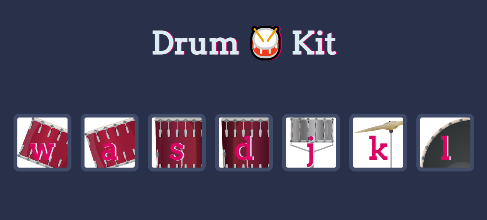

# Drum Kit
A drum kit program made using HTML, CSS, and JavaScript.

## Features
- A virtual drum kit with realistic drum sounds
- Playable using keyboard or mouse clicks
- Responsive design for different screen sizes

## How to Use
1. Clone the repository or download the files to your local machine
2. Open the `index.html` file in your browser
3. Start playing the drum kit using your keyboard or mouse

## Technologies Used
- HTML
- CSS
- JavaScript

## Credits
This program is based on the course "The Complete Web Developer Bootcamp" by Angela Yu, available on [Udemy](https://www.udemy.com/course/the-complete-web-development-bootcamp/).
